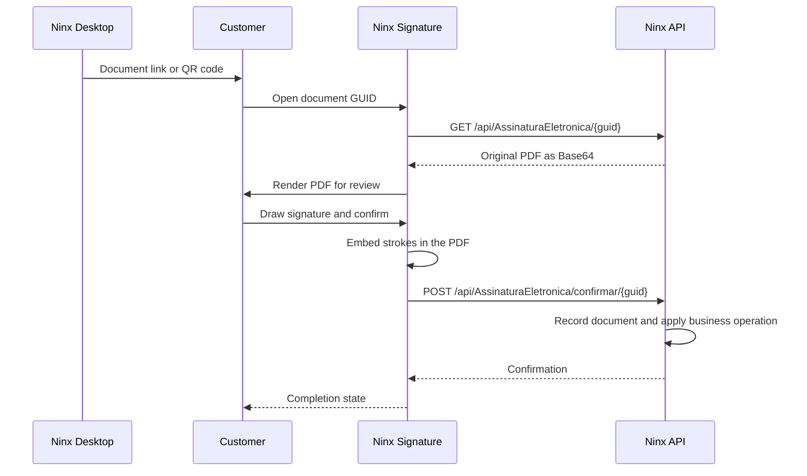

<div align="center">

# Ninx Signature

**Review and sign retail credit documents directly in the browser.**

[](https://github.com/maat-aug/ninx-signature/actions/workflows/azure-static-web-apps-ambitious-mud-07c7e1c10.yml)


[Features](#features) · [Architecture](#architecture) · [Getting Started](#getting-started) · [API Integration](#api-integration)

</div>

Ninx helps small retailers manage sales and **store credit (fiado)**: purchases paid for later. This repository provides the customer-facing step in that workflow: open a document link or QR code, review the PDF, draw a signature, and submit it to the [Ninx .NET API](https://github.com/maat-aug/ninx-api).

The page requires no customer account or application installation. It is a static HTML, CSS, and JavaScript application, with a Brazilian Portuguese interface and no package-manager build step.

## Features

- **PDF review:** render the document in the browser and navigate between pages.
- **Handwritten signatures:** draw over the document with pointer input, undo strokes, or clear the current page.
- **Touch interaction:** pinch to zoom while reviewing the document.
- **Draft recovery:** preserve page strokes in local storage, keyed by document GUID, and clear the draft after successful submission.
- **PDF submission:** embed the drawn strokes into the original PDF and send the result to the API.
- **Feedback:** dedicated loading, document, error, and completion states, with API business-error messages surfaced to the signer.

## Tech Stack

| Technology | Role |
| --- | --- |
| HTML / CSS / vanilla JavaScript | A focused signing interface without a frontend framework or build pipeline. |
| Canvas / Pointer Events | Document display, signature input, and touch interaction. |
| PDF.js 3.11.174 | PDF rendering in the browser, using a worker. |
| pdf-lib 1.17.1 | Embedding signature strokes into the PDF before submission. |
| Fetch / local storage | API communication and local draft persistence. |
| Azure Static Web Apps / GitHub Actions | Static hosting, route fallback, response headers, and deployment. |

PDF.js and pdf-lib are loaded from CDN URLs pinned in [`index.html`](src/index.html), with Subresource Integrity attributes. The PDF.js worker is fetched with an integrity check before being instantiated.

## Architecture

This repository owns document display and signature capture. Document generation, business validation, signing metadata, and persistence belong to the backend.



<details>
<summary><strong>Files and integration boundaries</strong></summary>

```text
src/
  index.html                Page structure and pinned CDN scripts
  style.css                 Layout and interaction styling
  app.js                    PDF rendering, strokes, drafts, and API requests
  favicon.svg               Browser icon
  staticwebapp.config.json   Route fallback and hosting response headers
.github/workflows/          Azure Static Web Apps deployment
```

The page uses a document GUID as its access link, without a JWT login. The backend controls document availability and confirmation, including rejecting repeated signing or inactive documents. The signed PDF and evidence are stored by the API.

The captured mark is a drawn electronic signature embedded in a PDF. The browser does not apply a certificate-based digital signature.

</details>

## Getting Started

### Prerequisites

- A modern browser and internet access for the CDN-hosted PDF libraries.
- A running [Ninx API](https://github.com/maat-aug/ninx-api#readme).
- A pending document GUID created through a Ninx account-agreement, credit-sale, or repayment workflow.
- A static HTTP server. The example below uses Python 3; Python is only a local serving tool, not an application dependency.

### 1. Clone and select the API

```bash
git clone https://github.com/maat-aug/ninx-signature.git
cd ninx-signature
```

In `src/app.js`, change the `API_BASE` constant from its hosted URL to your local API origin:

```javascript
const API_BASE = 'https://localhost:7093';
```

Trust the API's development HTTPS certificate first, or use its HTTP launch profile at `http://localhost:5258` for local testing. This application does not load a `.env` file.

### 2. Serve the static files

```bash
python -m http.server 8081 --directory src
```

Open `http://localhost:8081/?guid=YOUR_PENDING_DOCUMENT_GUID`, replacing the placeholder with a real pending document GUID from your local API.

The query-string form works with a basic static server. The alternative `/documento/{guid}` route requires fallback to `index.html`; Azure hosting supplies that fallback through `staticwebapp.config.json`. With the Python server above, convert a generated `/documento/{guid}` link to `/?guid={guid}` before opening it.

### 3. Exercise the signing flow

1. Verify that the expected document loads and its pages are readable.
2. Draw a signature; check undo, clear, and page navigation.
3. Reload before submitting to check draft recovery.
4. Confirm the signature and verify the completion state.
5. Return to Ninx Desktop to check the updated document and operation status.

Use local test documents: confirmation changes the associated operation in the API. For a phone or another device, replace `localhost` URLs with reachable addresses and serve the API with a certificate trusted by that device when using HTTPS.

## API Integration

| Request | Contract used by the page |
| --- | --- |
| `GET /api/AssinaturaEletronica/{guid}` | Reads `documentoBase64` from the response to load the PDF. |
| `POST /api/AssinaturaEletronica/confirmar/{guid}` | Sends `{ "ImagemBase64": "<signed PDF as Base64>" }`. |

The confirmation field retains its API name, `ImagemBase64`, but contains the modified PDF rather than a standalone signature image. Error handling reads the API's `messagem` field.

See the backend's local [Swagger UI](https://localhost:7093/swagger) for endpoint documentation.

## Deployment and Verification

The [Azure workflow](.github/workflows/azure-static-web-apps-ambitious-mud-07c7e1c10.yml) deploys the `src` directory on pushes to `main`, manages pull-request preview deployments, and closes previews when pull requests close. It requires the Azure Static Web Apps deployment token referenced in the workflow.

[`staticwebapp.config.json`](src/staticwebapp.config.json) configures navigation fallback, Content Security Policy, and other response headers. When changing the hosted API origin, update both `API_BASE` and the policy's `connect-src` allowlist. A basic local Python server does not apply these Azure hosting headers.

This repository does not currently include an automated test suite. The local signing checklist above covers the main manual verification flow; backend signature behavior is tested in `ninx-api`.

## Ninx Ecosystem

| Repository | Responsibility |
| --- | --- |
| [ninx-api](https://github.com/maat-aug/ninx-api) | C#/.NET business rules, document generation, signature confirmation, and storage. |
| [ninx-front](https://github.com/maat-aug/ninx-front) | Desktop sales and credit workflows that expose signing links and QR codes. |
| **ninx-signature** | Browser-based document review and signature capture. |

## Academic Context

Ninx is my Information Systems capstone project (**Trabalho de Conclusão de Curso — TCC**). This signing interface extends the C#/.NET backend into a customer-facing workflow, connecting retail credit operations with document review and confirmation.

## License

No license file is currently included in this repository.

## Author

**Matheus Augusto Teixeira Silva** — Information Systems student focused on C# and .NET.

[GitHub](https://github.com/maat-aug) · [LinkedIn](https://www.linkedin.com/in/matheus-augusto-a89348265/)
